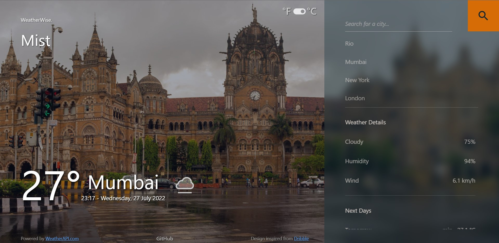
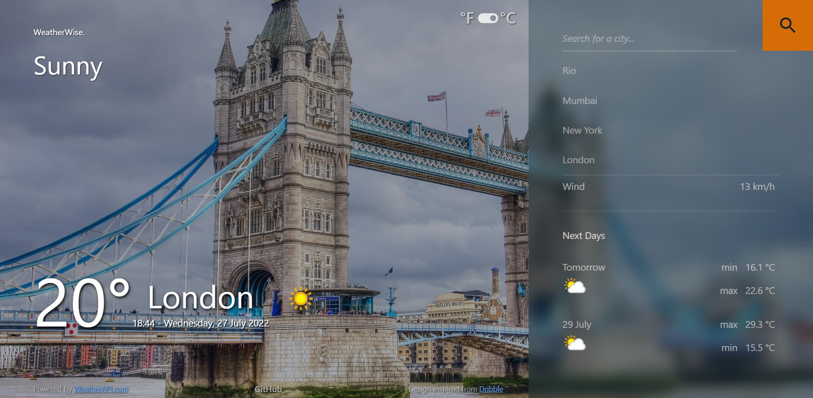
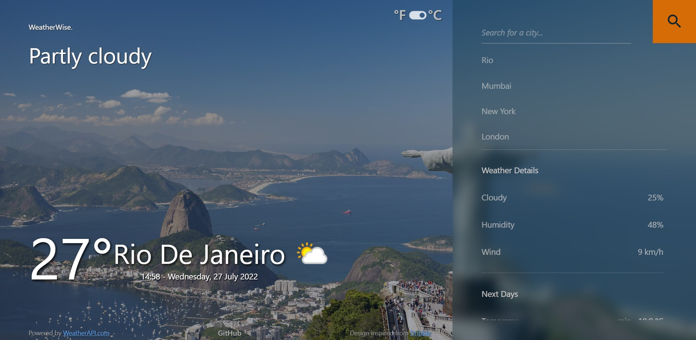

# WeatherWise

### A Desktop App created using Tauri and React

#
- Clone the repository
- ```cd WeatherWise```
- ```git checkout desktop-app```
- ```npm install --dev```
- ```npm start```

<!-- ## App Deployed [here](https://abhisinha08.github.io/WeatherWise/) -->

<!-- ## Screenshots  
#
  

  

 -->